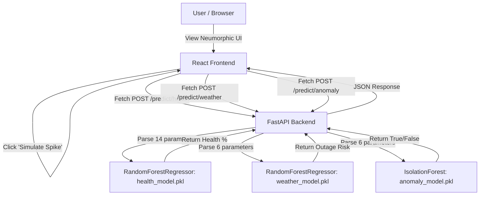

# Architecture

The system utilizes a decoupled architecture where a React frontend communicates with a Python FastAPI backend, which serves pre-trained scikit-learn models.

## System Diagram

## Component Breakdown

| Component | Technology | Responsibility |
|---|---|---|
| **Frontend** | React, Vite, CSS (Neumorphism) | Displays live telemetry and handles user interactions. |
| **Backend** | Python, FastAPI | Exposes REST endpoints (`/predict/*`) and loads model pickles. |
| **Machine Learning** | Scikit-learn, Pandas | Predicts numerical health scores and detects multi-variate anomalies. |
